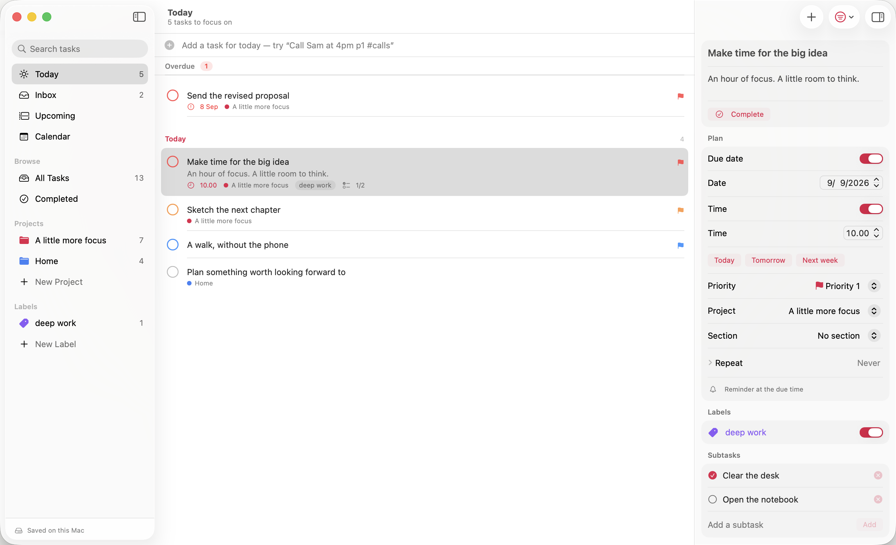
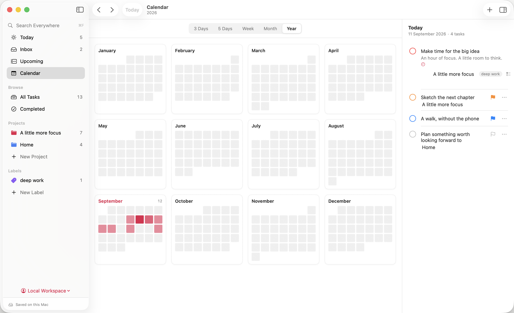
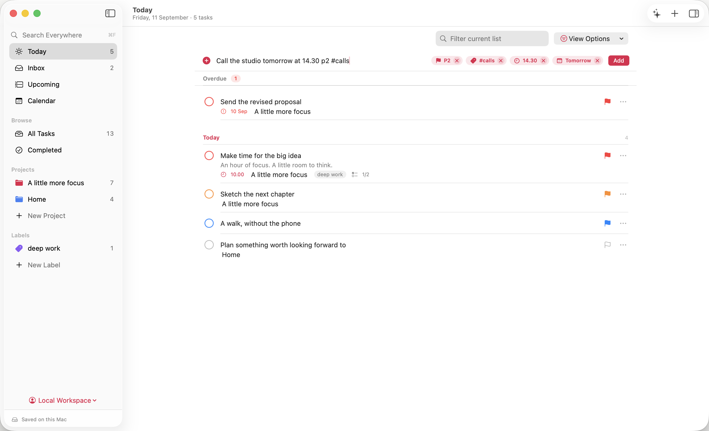
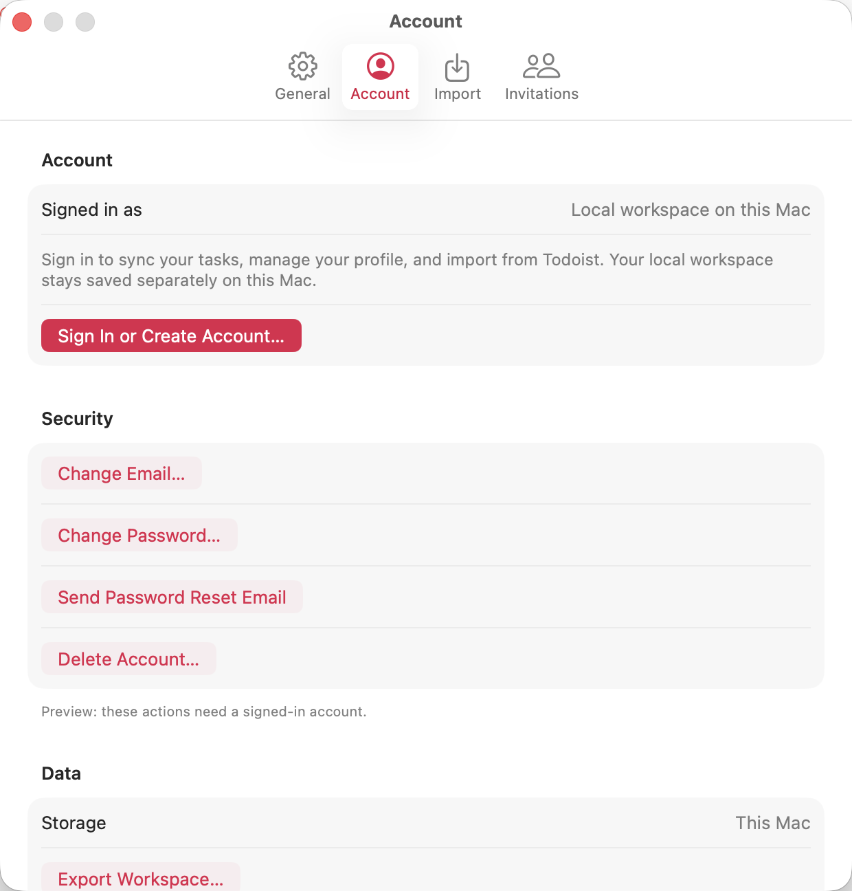
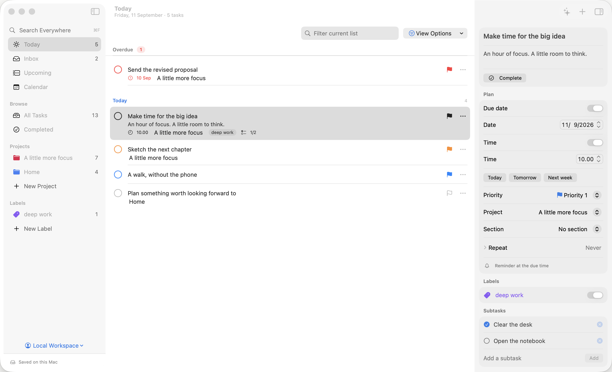

# Taskfold for macOS

A native SwiftUI Mac app for Taskfold, built to feel like a first-class Mac citizen rather than a scaled-up phone app. It shares its data layer with [dbakp/TaskFold-iOS](https://github.com/dbakp/TaskFold-iOS): the `Core` sources (`Models.swift`, `Store.swift`, `Backend.swift`) and `Backend.plist` are referenced from that checkout, not copied, so backend access, the durable sync queue, undo history, recurrence, day placement, and quick entry stay identical across platforms.

## Layout

```
TaskFold-Mac/
├── taskfold-ios/      # git clone https://github.com/dbakp/TaskFold-iOS taskfold-ios (source of truth for Core)
├── taskfold/          # git clone https://github.com/dbakp/taskfold (web app, layout reference)
└── taskfold-mac/      # this repository
```

Clone the iOS repository next to this one before opening the project. `Taskfold.xcodeproj` references `../taskfold-ios/Taskfold/Core/*.swift`, `../taskfold-ios/Taskfold/Backend.plist`, and the shared `TaskfoldIcon.icon`.

## Run

```sh
xcodebuild -project Taskfold.xcodeproj -scheme Taskfold -configuration Debug -derivedDataPath DerivedData -allowProvisioningUpdates build
open DerivedData/Build/Products/Debug/Taskfold.app
```

Requires Xcode 26 and macOS 15. Signing uses the personal team `3UZ4C73FM2` with automatic provisioning; the app is sandboxed with network client, user-selected files, and a keychain access group.

Sign in with email/password or Google (`ASWebAuthenticationSession` with PKCE, callback `taskfold://auth/callback`), or choose **Use on this Mac without an account** for a local workspace.

## Install

`Scripts/make_dmg.sh` produces `dist/Taskfold-<version>.dmg`: a compressed disk image with the app, an Applications shortcut, and a short "How to install" note. By default it makes a **distribution build**: signed ad hoc with no provisioning profile, so it never expires and runs on any Mac. Because it is not notarized (that needs a paid Apple Developer account), the first launch is blocked with "could not verify"; open System Settings ▸ Privacy & Security and click **Open Anyway** once. Distribution builds carry only the sandbox, network, and user-selected-file entitlements and leave out the Today widget extension, which needs a team-provisioned App Group.

`Scripts/make_dmg.sh --development` makes the team-signed build with the widget instead. It runs only on Macs registered to the team and stops launching when its seven-day provisioning profile expires, so it is for local use.

### Releases

The current build is published as a GitHub release with the DMG attached: [github.com/dbakp/TasskFold-MacOS/releases/latest](https://github.com/dbakp/TasskFold-MacOS/releases/latest). `Scripts/publish_release.sh` rebuilds the distribution image and creates the release for the app's version, or replaces the asset when that version's release already exists; bump `MARKETING_VERSION` in `Scripts/generate_project.py` for a new version.

## Welcome tour

A five-page tour opens on first launch and can be skipped at any point (Skip, Escape). It is built from the app's own components: the real quick-entry chips appear as a sentence is typed, a task drifts across priority bands and snaps back with the "Stays with P3" hint, the Plan Your Day card shows the keyboard shortcuts, and the last page picks the accent and offers sign-in. ← → and Return move between pages. Help ▸ Welcome Tour and Settings ▸ General ▸ Show Welcome Tour bring it back.

## What is here

- **NavigationSplitView** with a sidebar (Today, Inbox, Upcoming, Calendar, Browse ▸ All Tasks / Completed, Projects, Labels), a content list, and a trailing **inspector** that edits the selected task in place and saves as you go. No sheets for editing.
- **Keyboard**: arrow keys move selection, Space completes, Return edits (focuses the inspector title), Esc clears selection, ⌫ deletes, ⌘N new task (opens and focuses the task-entry panel, which understands the shared quick-entry grammar), ⇧⌘N new project, ⌘Z / ⇧⌘Z undo and redo through the system undo manager, ⌘F search everywhere, ⌘K command finder, ⇧⌘F filter the current list, ⌘1…⌘5 sidebar sections, ⌥⌘I inspector, ⌘R sync. Every shortcut has a menu bar item.
- **Multi-select** with shift/⌘-click, right-click context menus for one or many tasks, and a **Task** menu with reschedule, move, priority, duplicate, and delete.
- **Drag and drop** with macOS drag sessions and a real drag image (title, priority ring, count badge for multi-drags). Drop between days, onto day headers, onto empty days, onto sidebar items (Today, Upcoming, Inbox, any project), and onto calendar days. Reordering within a day preserves the iOS `DayPlacement` semantics and is one undoable change. Trackpad feedback marks slot changes and drops.
- **Undo affordance**: a brief, non-blocking confirmation strip at the foot of the list ("Completed “…” · Undo ⌘Z") in addition to Edit ▸ Undo.
- **Calendar** with 3-day, 5-day, week, month, and year modes laid out for a wide window: day columns or a month grid with equal-height weeks (overflow collapses into "+n more"), and the selected day's tasks in a side panel that appears when the window is wide enough for it. Tasks open in the inspector; ← / → move between periods; ⌘T jumps to today.
- **Ordering**: every list is arranged by priority band (P1 first) with the user's manual order inside each band, the same `DayPlacement.arranged` rule as iOS. Drops stay inside the task's band; the insertion indicator shows where the task really lands and a "Stays with P2" hint explains a snapped drop. Inbox, projects, sections, and labels reorder manually with device-local placement keys.
- **Quick entry chips**: dates, times, priorities, labels, and recurrence parsed from the title appear as chips in the task-entry panel and the inspector; ✕ (or Space / Delete on a focused chip) keeps those words in the title.
- **Links**: URLs in titles and notes render as accent-coloured page titles (fetched once, cached); click opens the browser without selecting the row, hover previews the page, right-click offers Open, Copy Link, and Share.
- **Planning**: Plan Your Day (⌥⌘P) and Review This Week (⌥⌘W) triage tasks one card at a time with T, M, D, Space, and →.
- **Account**: change email or password, send a password reset, or delete the account from Settings ▸ Account. Reminders offer Complete, Remind me in 1 hour, and Move to tomorrow.
- **Shortcuts and widgets**: the shared App Intents (Add Task, What's Due Today, Complete Task) appear in Shortcuts; a Today widget (small, medium, large) reads the App Group snapshot the app publishes.
- **Layout**: task lists read in a centered column (max 860 pt) the way Todoist lays out its lists; global search remains in the sidebar, while the current-list filter and view options sit above the tasks in the upper-right corner. The toolbar plus or ⌘N opens a native task-entry panel with a prominent input, destination, parsing chips, and Add Task action. It closes after submission and preserves drafts when dismissed with Escape. Drafts can be reopened after revisiting a destination, and view options are scoped to each list.
- **Motion**: `Views/Motion.swift` keeps the iOS spring vocabulary (layout, quick, lift, settle, track) tuned shorter and subtler for the Mac; `Views/Transitions.swift` translates the [transitions.dev](https://transitions.dev) token scale (durations, easings, distances, scales, blur) into SwiftUI recipes: text-state swap, icon swap, toast open/close, panel reveal, notification-badge pop, number pop-in, stroke-drawn success check, error-state shake, skeleton reveal, shimmer text, sliding tabs, and the hover-in/hover-out asymmetry. All respect Reduce Motion.
- Light and dark mode, system text scaling, VoiceOver labels, pointer cursors, hover states, resizable columns, window state restoration, a unified toolbar with the search field, a Settings window (⌘,), notifications for due tasks, collaborators, invitations, and Todoist import.

The sidebar account menu provides direct access to sign-in, profile management, Settings, Todoist import, and invitations. Todoist import previews data before importing. In a task comment, pasting an image with ⌘V immediately saves it as an attachment while keeping your unfinished text. Click its thumbnail to open Quick Look.

## Tests

The shared Core tests live in the iOS repository:

```sh
cd ../taskfold-ios && swift test
```

macOS UI tests use isolated data and cover navigation, search and keyboard focus, scoped filters, account-screen access, comment image persistence, date edits, completion/undo, and day-to-day dragging:

```sh
xcodebuild -project Taskfold.xcodeproj -scheme Taskfold -derivedDataPath DerivedData -allowProvisioningUpdates test
```

UI testing on macOS asks once for Accessibility permission for the test runner. Passing `TEST_RUNNER_TASKFOLD_SCREENSHOTS=1` to `xcodebuild test` also renders the report screenshots (see `Screenshots/`) into the runner's temporary directory; the path is printed in the log.

Two macOS specifics worth knowing: rows use `itemProvider` (the table's own dragging) rather than `onDrag`, because a SwiftUI drag gesture on a List row swallows the click that selects it; and Space / Return / Escape are routed by `Views/KeyRouter.swift`, a local key-event monitor that steps aside whenever a text field is editing, because table-backed lists do not forward those keys to SwiftUI key handlers.

Debug-only launch arguments: `--preview` (illustrative tasks), `--uitesting` with `--day-drag-fixture`, `--priority-fixture`, `--link-fixture`, or `--navigation-fixture` (test fixtures in a separate local namespace), `--section=<key>`, `--calendar-mode=<mode>`, `--appearance=light|dark`, `--accent=<key>`, `--select-title=<title>`, `--open-settings=<tab>`, `--preview-account`, `--onboarding`, `--capture=<file>`. Release builds ignore them. Fixture launches ignore saved window state so a force-quit test run cannot restore a windowless app.

## Screenshots

| Today, light | Today, dark |
| --- | --- |
|  |  |

| Calendar week | Calendar month, dark | Calendar year |
| --- | --- | --- |
|  |  |  |

| Quick-add with chips | Settings ▸ Account | Sky accent |
| --- | --- | --- |
|  |  |  |

## macOS polish work

The implementation sequence and acceptance checks live in [the polish plan](docs/PREMIUM_MAC_PLAN.md). The comparison with the original app and remaining account/feature work live in [the parity plan](docs/FEATURE_PARITY.md).

You can point Xcode at a separate clean iOS checkout without modifying your existing iOS work:

```sh
xcodebuild -project Taskfold.xcodeproj -scheme Taskfold -configuration Release \
  -derivedDataPath /tmp/taskfold-mac-build \
  TASKFOLD_IOS_ROOT=/absolute/path/to/TaskFold-iOS -allowProvisioningUpdates build
```

The default shared-source location remains `../taskfold-ios`.
