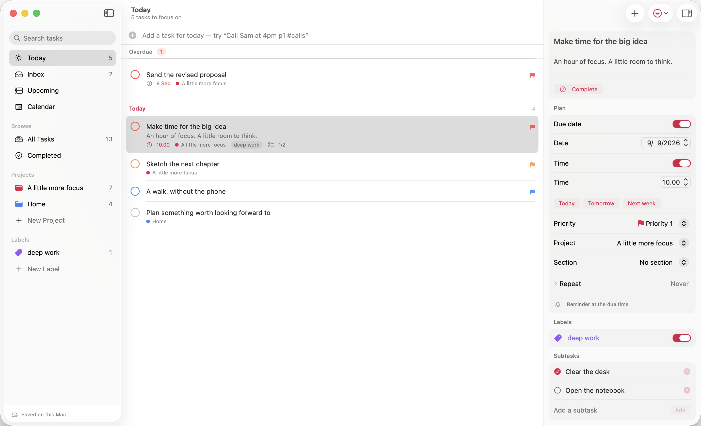
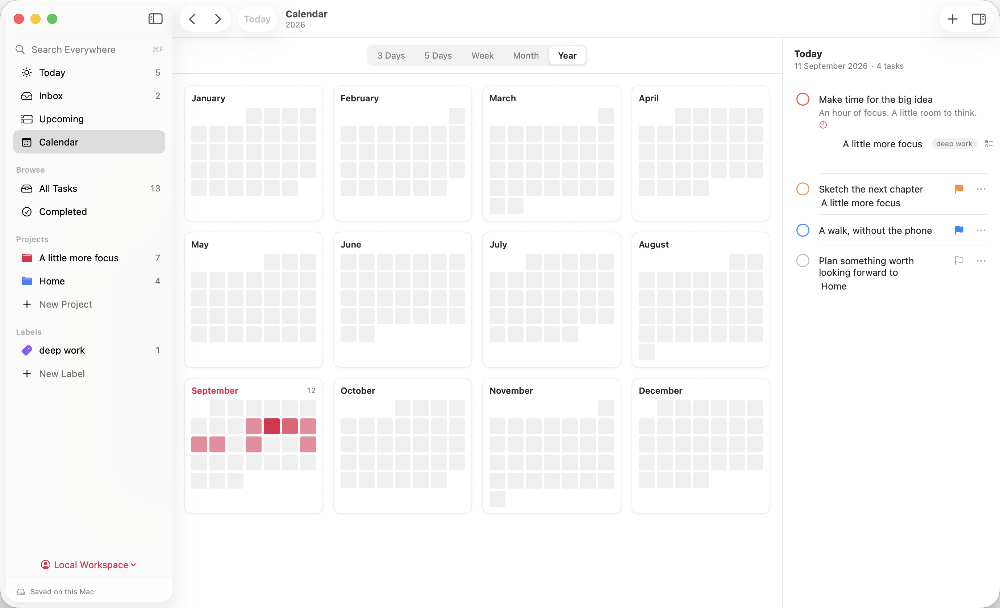
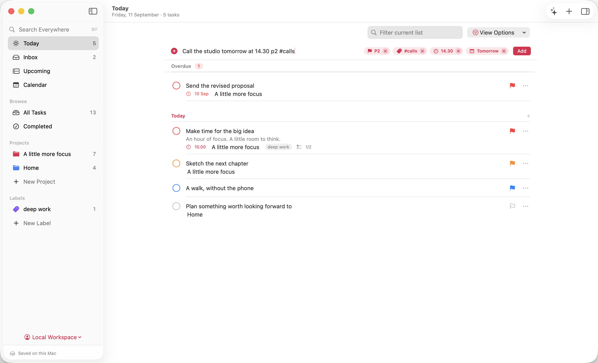
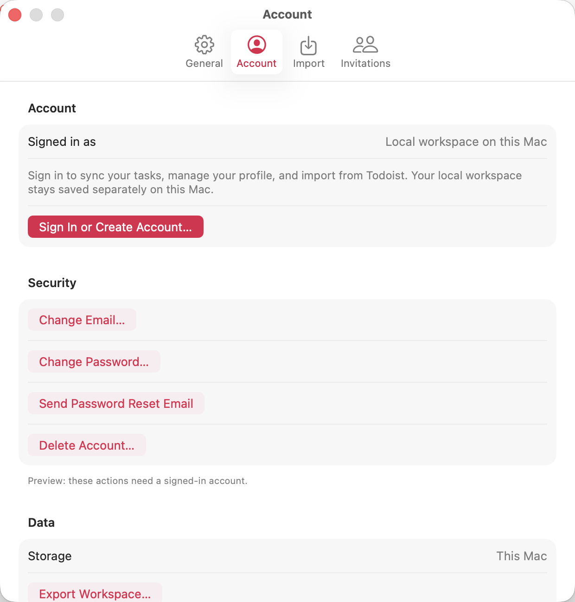
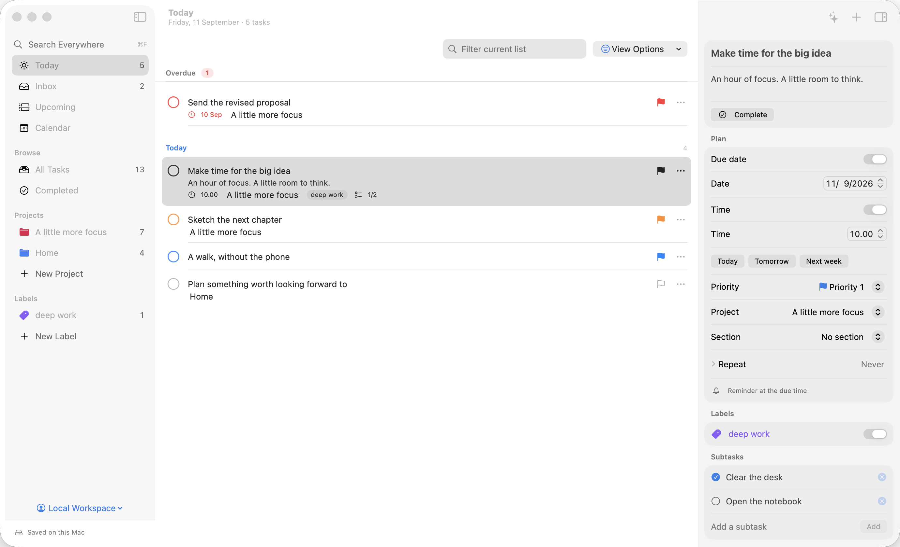

# Taskfold for macOS

A native SwiftUI Mac app for Taskfold. This repository owns all Mac app code, widgets, resources, configuration, tests and release tooling. A fresh clone builds independently. The iOS app lives in [dbakp/TaskFold-iOS](https://github.com/dbakp/TaskFold-iOS); both apps use the same backend and compatible data contracts. See [repository ownership and parity](docs/REPOSITORY_OWNERSHIP.md).

## Layout

```
Taskfold/             # Mac Core, native views, resources and backend configuration
TaskfoldWidgets/      # Mac widget extension
TaskfoldTests/        # Local Core and widget-model contract tests
TaskfoldUITests/      # Mac user-flow tests with isolated fixtures
Scripts/              # Project generation, tests, packaging and publishing
supabase/             # Backend migrations and isolation fixtures
```

After adding Swift files or resources, run `python3 Scripts/generate_project.py`. The generated project contains only repository-local inputs. No iOS checkout or dependency download is required.

## Run

```sh
xcodebuild -project Taskfold.xcodeproj -scheme Taskfold -configuration Debug -derivedDataPath DerivedData -allowProvisioningUpdates build
open DerivedData/Build/Products/Debug/Taskfold.app
```

Requires Xcode 26 and macOS 15. Signing uses the personal team `3UZ4C73FM2` with automatic provisioning; the app is sandboxed with network client, user-selected files, and a keychain access group.

Sign in with email/password or Google (`ASWebAuthenticationSession` with PKCE, callback `taskfold://auth/callback`), or choose **Use on this Mac without an account** for a local workspace.

## Install

`Scripts/make_dmg.sh` produces `dist/Taskfold-<version>.dmg`: a compressed disk image with the app, an Applications shortcut, and a short "How to install" note. By default it makes a **distribution build**: signed ad hoc with no provisioning profile, so it never expires and runs on any Mac. Because it is not notarized (that needs a paid Apple Developer account), the first launch is blocked with "could not verify"; open System Settings ▸ Privacy & Security and click **Open Anyway** once. Distribution builds carry sandbox, network, user-selected-file and calendar-read entitlements and leave out the widget extension, which needs a team-provisioned App Group.

`Scripts/make_dmg.sh --development` makes the team-signed build with the widget instead. It runs only on Macs registered to the team and stops launching when its seven-day provisioning profile expires, so it is for local use.

### Releases

Published distributions are available as GitHub releases with the DMG attached: [github.com/dbakp/TasskFold-MacOS/releases/latest](https://github.com/dbakp/TasskFold-MacOS/releases/latest). Development source includes unreleased P0 work tracked in [the implementation status](docs/P0_IMPLEMENTATION.md). Build and verify a candidate with `Scripts/make_dmg.sh`, then use `Scripts/publish_release.sh <notes-file>` to publish a new immutable version. Publishing requires committed sources and a matching build-input fingerprint. It refuses to replace an existing version; bump `MARKETING_VERSION` in `Scripts/generate_project.py` for a new release.

## Welcome tour

A five-page tour opens on first launch and can be skipped at any point (Skip, Escape). It is built from the app's own components: the real quick-entry chips appear as a sentence is typed, a task drifts across priority bands and snaps back with the "Stays with P3" hint, the Plan Your Day card shows the keyboard shortcuts, and the last page picks the accent and offers sign-in. ← → and Return move between pages. Help ▸ Welcome Tour and Settings ▸ General ▸ Show Welcome Tour bring it back.

## What is here

- **NavigationSplitView** with a sidebar (Today, Inbox, Upcoming, Calendar, Browse ▸ All Tasks / Completed, Projects, Labels), a content list, and a trailing **inspector** that edits the selected task in place and saves as you go. No sheets for editing.
- **Subtasks**: chevrons expand a task's subtasks directly beneath it, with one further sub-subtask level. Each nested row can be selected, edited in the inspector, completed/reopened, and undone independently. Add a subtask from the selected task's inspector; the deepest level offers no further nesting. Existing embedded subtask data is preserved, and expanded children stay attached when the parent is reordered.
- **Keyboard**: arrow keys move selection, Space completes, Return edits (focuses the inspector title), Esc clears selection, ⌫ deletes, ⌘N new task (opens and focuses the task-entry panel, which understands the shared quick-entry grammar), ⇧⌘N new project, ⌘Z / ⇧⌘Z undo and redo through the system undo manager, ⌘F search everywhere, ⌘K command finder, ⇧⌘F filter the current list, ⌘1…⌘5 sidebar sections, ⌥⌘I inspector, ⌘R sync. Every shortcut has a menu bar item.
- **Multi-select** with shift/⌘-click, right-click context menus for one or many tasks, and a **Task** menu with reschedule, move, priority, duplicate, and delete.
- **Drag and drop** with macOS drag sessions and a real drag image (title, priority ring, count badge for multi-drags). Drop between days, onto day headers, onto empty days, onto sidebar items (Today, Upcoming, Inbox, any project), and onto calendar days. Reordering within a day preserves the iOS `DayPlacement` semantics and is one undoable change. Trackpad feedback marks slot changes and drops.
- **Undo affordance**: a brief, non-blocking confirmation strip at the foot of the list ("Completed “…” · Undo ⌘Z") in addition to Edit ▸ Undo.
- **Calendar** with an hourly Day planner, 3-day, 5-day, week, month, and year modes laid out for a wide window: day columns or a month grid with equal-height weeks (overflow collapses into "+n more"), and the selected day's tasks in a side panel that appears when the window is wide enough for it. Tasks open in the inspector; ← / → move between periods; ⌘T jumps to today.
- **Ordering**: every list is arranged by priority band (P1 first) with the user's manual order inside each band, the same `DayPlacement.arranged` rule as iOS. Drops stay inside the task's band; the insertion indicator shows where the task really lands and a "Stays with P2" hint explains a snapped drop. Inbox, projects, sections, and labels reorder manually with account-owned synchronized placement keys.
- **Quick entry chips**: projects, sections, accepted project members, dates, times, priorities, labels, estimates, deadlines and repeat rules (weekday sets, monthly ordinals, yearly rules, completion anchoring and limits) parsed from the title appear as chips in the task-entry panel and the inspector; ✕ (or Space / Delete on a focused chip) keeps those words in the title.
- **Links**: URLs in titles and notes render as accent-coloured page titles (fetched once, cached); click opens the browser without selecting the row, hover previews the page, right-click offers Open, Copy Link, and Share.
- **Planning**: Plan Your Day (⌥⌘P) and Review This Week (⌥⌘W) triage tasks one card at a time with T, M, D, Space, and →.
- **Account**: change email or password, send a password reset, or delete the account from Settings ▸ Account. Reminders offer Complete, Remind me in 1 hour, and Move to tomorrow.
- **Shortcuts and widgets**: the shared App Intents (Add Task, What's Due Today, Complete Task) appear in Shortcuts; ten widget kinds read the App Group snapshot the app publishes.
- **Layout**: task lists read in a centered column (max 860 pt) the way Todoist lays out its lists; global search remains in the sidebar, while the current-list filter and view options sit above the tasks in the upper-right corner. The toolbar plus or ⌘N opens a native task-entry panel with a prominent input, destination, parsing chips, and Add Task action. It closes after submission and preserves drafts when dismissed with Escape. Drafts can be reopened after revisiting a destination, and view options are scoped to each list.
- **Motion**: `Views/Motion.swift` keeps the iOS spring vocabulary (layout, quick, lift, settle, track) tuned shorter and subtler for the Mac; `Views/Transitions.swift` translates the [transitions.dev](https://transitions.dev) token scale (durations, easings, distances, scales, blur) into SwiftUI recipes: text-state swap, icon swap, toast open/close, panel reveal, notification-badge pop, number pop-in, stroke-drawn success check, error-state shake, skeleton reveal, shimmer text, sliding tabs, and the hover-in/hover-out asymmetry. All respect Reduce Motion.
- Light and dark mode, system text scaling, VoiceOver labels, pointer cursors, hover states, resizable columns, window state restoration, a unified toolbar with the search field, a Settings window (⌘,), notifications for due tasks, collaborators, invitations, and Todoist import.

The sidebar account menu provides direct access to sign-in, profile management, Settings, Todoist import, and invitations. Todoist import previews data before importing. In a task comment, pasting an image with ⌘V immediately saves it as an attachment while keeping your unfinished text. Click its thumbnail to open Quick Look.

## Tests

Core and widget-model tests run from this repository:

```sh
Scripts/test_core.sh
Scripts/test_core.sh -c release
```

macOS UI tests use isolated data and cover navigation, search and keyboard focus, scoped filters, account-screen access, comment image persistence, date edits, completion/undo, and day-to-day dragging:

```sh
Scripts/test_mac.sh test
```

UI testing on macOS asks once for Accessibility permission for the test runner. Passing `TEST_RUNNER_TASKFOLD_SCREENSHOTS=1` to `xcodebuild test` also renders the report screenshots (see `Screenshots/`) into the runner's temporary directory; the path is printed in the log.

Two macOS specifics worth knowing: rows use `itemProvider` (the table's own dragging) rather than `onDrag`, because a SwiftUI drag gesture on a List row swallows the click that selects it; and Space / Return / Escape are routed by `Views/KeyRouter.swift`, a local key-event monitor that steps aside whenever a text field is editing, because table-backed lists do not forward those keys to SwiftUI key handlers.

Debug-only launch arguments: `--preview` (illustrative tasks), `--uitesting` with `--day-drag-fixture`, `--priority-fixture`, `--link-fixture`, or `--navigation-fixture` (test fixtures in a separate local namespace), `--section=<key>`, `--calendar-mode=<mode>`, `--appearance=light|dark`, `--accent=<key>`, `--select-title=<title>`, `--open-settings=<tab>`, `--preview-account`, `--onboarding`, `--capture=<file>`. Release builds ignore them. Fixture launches ignore saved window state so a force-quit test run cannot restore a windowless app.

## Screenshots

| Today, light | Today, dark |
| --- | --- |
|  |  |

| Calendar week | Calendar month, dark | Calendar year |
| --- | --- | --- |
|  |  |  |

| Quick-add with chips | Settings ▸ Account | Sky accent |
| --- | --- | --- |
|  |  |  |

## macOS polish work

The implementation sequence and acceptance checks live in [the polish plan](docs/PREMIUM_MAC_PLAN.md). The comparison with the original app and remaining account/feature work live in [the parity plan](docs/FEATURE_PARITY.md).

## Collaboration

The Mac now supports task/subtask assignments, Assigned to Me, and reviewable concurrent edits. See [the collaboration implementation and next steps](docs/COLLABORATION.md).

The Mac code and release inputs are owned locally. Cross-platform changes are implemented and tested in both repositories; there is no revision pin, source fetch or sibling path in the Mac build.

The configured backend already has the collaboration migrations and the newer iOS member-profile migration `20260914091713_project_member_profiles.sql`. Do not replay the older Mac directory migration over that deployed definition. A new backend needs the current iOS schema/profile migration and the collaboration prerequisites.

Release products build in `~/Library/Caches/TaskfoldBuild` (outside synced Documents folders); the DMG lands in `dist/`. `Scripts/publish_release.sh <notes-file>` requires committed sources and verifies the DMG source fingerprint, then creates a new immutable version tag and GitHub release. Never publish until runtime verification is complete.

## Productive widgets and feature roadmap

The provisioned widget extension includes Today, Focus, Week ahead, Quick capture, Deadline radar, A small window, My list, Day capacity, Inbox reset and Pinned note. Today opens individual tasks and exposes +; Focus explains one selected next action; Week ahead shows seven actual task counts and opens Upcoming. Soft surfaces adapt to light/dark appearance. The ad hoc distribution DMG still excludes widgets.

See [the detailed Todoist feature plan](docs/TODOIST_PORT_PLAN.md) for the source audit, import API compatibility risk, phased backlog, estimates, data migrations and acceptance criteria. [Widget preview](docs/widget-previews/catalog.png). Run `python3 Scripts/render_widget_previews.py` to render the SwiftUI fixture views in light, dark and empty states. Rendering does not prove installed WidgetKit-host behavior.


## Quick-entry destinations and labels

`Write proposal #"Client Work" /"Next steps" +Alex @"Client notes" ~25m {2026-10-09}` selects existing project/section/member targets, a label, a time estimate and an independent deadline. Names with spaces need quotes. `+me` uses your own project membership; other people match an exact display name/email or a unique first name in the available accepted-member directory.

Known `#Name` references select projects; unknown hash names retain the older label meaning. A project/label name collision requires `#project:"Name"` for the project or `@"Name"` / `%"Name"` for the label. Parsing never creates projects or sections. Unavailable, multiple or ambiguous destinations remain in the title with feedback. Declining a different project keeps its dependent section/person references literal. Escaped references such as `\#"Client Work"`, ordinary quoted phrases, URLs, emails and file paths remain literal.

The capture panel previews the actual parsed destination. Saving a project change clears incompatible section and assignment values, including child assignments. The inspector and Shortcuts use the same account-scoped reference rules. New label edits store stable IDs compatible with iOS and web; older label names, existing IDs and unknown legacy values remain readable. Repeat rules now include weekday sets, monthly ordinals, yearly dates, completion anchoring and start/end/count limits. Named boundaries, sub-day rules, independent reminder recurrence and autocomplete remain pending; see [repeat syntax](docs/RECURRENCE.md).


## Productive widgets

The widget collection includes Today, Focus, Week ahead, Quick capture, **Deadline radar**, **A small window**, **My list**, **Day capacity**, **Inbox reset** and **Pinned note**. Deadline radar shows missed and approaching independent deadlines, with a 7-, 14- or 30-day look-ahead. Rescheduling planned work leaves the cutoff intact. A small window suggests tasks with a known estimate within a 10-, 25- or 45-minute budget; unestimated work is counted separately. Choose Ready work (today, overdue and undated), Inbox, or All open tasks (including future dates). Each instance has its own settings. Both new widgets support small and medium sizes, Default/Rose/Lavender/Mint color choices and a preference to hide task and project names. Task rows open the native task editor.

A versioned read-only App Group snapshot carries stable project IDs, independent deadlines, estimates and fixed scheduling instants. Fixed times use the device's local day after travel; floating times retain their wall-clock date. Signed-out snapshots clear task data. Daily timeline entries use actual local midnights across daylight-saving changes; stale snapshots ask the user to refresh. Widgets use cached app data and require the app to refresh remote changes.

Selected project/label/filter scopes and My list completion buttons are implemented; installed-host acceptance remains pending. Source renders and model tests do not establish every installed host, accessibility size or distribution entitlement. See [P0_IMPLEMENTATION.md](docs/P0_IMPLEMENTATION.md) for the verified scope. The distributed ad hoc DMG currently excludes widgets; desktop installation needs an App Group-capable provisioned build.

## Backups and restore

Versioned JSON export, validated restore previews, both matching policies, encrypted manual/daily recovery copies and 20-copy retention are implemented locally in this app. See [backup behavior and verification scope](docs/BACKUPS.md). Private recovery files stay on their device; portable exports work across the native apps.

## Reviewed sync edits

Both native clients use guarded task edits and review overlapping changes before continuing. Later offline work remains queued; older edits without a baseline require review. See [sync review behavior and verification](docs/SYNC_CONFLICTS.md).

## Multiple reminders

The inspector’s Reminders screen supports fixed dates and offsets before or after planned time, per-task opt-out, device/workspace delivery permission and visible scheduling feedback. Reminder choices sync with iOS through the guarded task queue. Completion, deletion, rescheduling and account switches invalidate stale reminders and snoozes. See [behavior, the persisted contract and the remaining remote delivery plan](docs/REMINDERS.md).

Quick entry also accepts multiple `!30m` (from now), `!30mb` (before the plan), and `!tomorrow 9am` fixed reminder shortcuts. Each has its own removable chip; see [reminder syntax and delivery](docs/REMINDERS.md#reminders-in-quick-entry).


## Bulk deadlines

Select tasks → inspector Actions → Edit Deadlines, use the task context menu, or Task → Edit Deadlines (⌘⌥⇧D). Set one hard cutoff or clear existing cutoffs after reviewing current deadlines and planned dates/times. The edit preserves plans, fixed instants, estimates and reminders and uses one undo step. Cancel saves nothing; unchanged/missing tasks are skipped. Selection and workspace are captured when opening the sheet, current records are used at Apply, and switching workspaces prevents saving into another account. [Current test evidence](docs/P0_IMPLEMENTATION.md#6-october-bulk-deadline-editing) distinguishes iPhone runtime checks from Mac compilation.


## Choose a widget list

**My list** keeps one project’s, label’s or saved filter’s open tasks on the Home Screen or desktop in small, medium or large size. Edit the widget to choose its list, color and whether task/list names are hidden. Each instance chooses independently. Task titles open the task, and the separate circle completes it. Small widgets open their visible task from the background; medium and large widgets open the selected list. A small window and Deadline radar can also be limited to one selected list; their budget/Ready work or deadline horizon still applies.

List selections use stable IDs bound to the current workspace. Rename keeps the selection. Deleted/inaccessible lists ask you to refresh or choose again. Signed-out snapshots clear all tasks and list metadata. Saved filters use the native evaluator to prepare eight local days of open-task membership, including DST midnights; exhausted dates or a changed device time zone ask you to open the app. Widget data remains cached until the app publishes a new snapshot. Project and label lists use default priority ordering; filters use their saved sort. My list shows only open tasks even if a saved filter includes completed work. My list completion is implemented; installed-host acceptance remains pending.

[Light widget preview](docs/widget-previews/lists.png), [dark](docs/widget-previews/lists-dark.png), [names hidden](docs/widget-previews/lists-private.png), [empty](docs/widget-previews/lists-empty.png), [unavailable](docs/widget-previews/lists-unavailable.png). `python3 Scripts/render_widget_previews.py --lists` renders the repository’s real SwiftUI fixture views on macOS; those images alone do not prove installed-host behavior.


Recurring completion now gives each next occurrence a stable ID and a create-only insert, preserves the fixed schedule's source time zone after travel, and renews checklist IDs and planned dates. Task deletion and undo carry the whole saved task as a baseline; newer synced work pauses for review with Keep task/Delete task choices. Both clients use the shared `taskfold_delete_task` backend guard while owning all native sources independently. My list completion now uses account-bound taps, a durable handoff and private save receipts. Installed-host execution and paired-device acceptance remain pending. See the platform validation record for verified behavior and outstanding runtime checks.

## Complete from My list

Tap the circle beside a task to complete it through the app’s saved mutation queue. My list shows one, two or five actionable rows in small, medium or large sizes, with 44-point completion targets. A queued tap shows an hourglass and “Open Taskfold to finish”; a locally saved edit waiting for upload shows “Saved · sync pending”. Titles and counts stay visible until the task is saved. Duplicate taps reuse their receipt, and a completed or locally reopened task cannot be changed by an older tap. Accepted requests from another workspace wait for that workspace rather than changing the active one.

No account credentials enter the widget action file. The private cache owns completion tokens and save receipts; workspace exports omit them. The bounded handoff refuses new requests at capacity instead of discarding accepted work. `python3 Scripts/test_widget_handoff.py` exercises concurrent app/extension-style processes. [Dense list](docs/widget-previews/lists-dense.png), [queued action](docs/widget-previews/lists-pending.png) and [sync pending](docs/widget-previews/lists-sync.png) previews use the real SwiftUI views. A deployed server revision guards new native completion queues against unseen remote completion/reopen cycles. Installed WidgetKit execution and paired-device acceptance remain release checks.

Completion/reopen edits now capture a server-owned revision as well as their field baselines. If another device completes and reopens the task while this one is offline, sync pauses for review. “Use synced” removes an unedited, unsent next occurrence from that completion; later work on it is retained as an independent task. Explicit completion times survive lost-response retries. Exports retain the historical revision, while newly restored tasks begin a new counter and existing restored tasks keep the current server counter. Older queued completions without a revision require review. This protection applies to the new native clients; older distributed clients retain their legacy write behavior.


## Day capacity

**Day capacity** compares the whole working day with known task estimates and busy time from calendars you explicitly connect in Planner settings. It offers small and medium sizes, Today or Tomorrow, a separate palette per instance and a setting to hide capacity details. Unestimated tasks and overdue work outside that day's plan are counted explicitly. This is a whole-day planning budget, not the hours remaining on the clock. Tap to open the corresponding native Day planner.

Working hours synchronize with your account. Calendar connection and selection stay on each device. Calendar busy intervals are counted once; overlapping task estimates remain separate workloads. The widget receives daily totals only. Calendar totals expire after one hour and ask for refresh; open Taskfold to refresh remote tasks and local calendar data. The app refreshes while active, on foreground/calendar/configuration/time-zone/day changes and every 15 minutes while active.

See the repository-owned [SwiftUI previews](docs/widget-previews/capacity.png). Reproduce them with `python3 Scripts/render_widget_previews.py --capacity`. Installed-widget and real-calendar acceptance remain separate from these source renders and native app tests.


## Inbox reset

**Inbox reset** shows all open tasks without a project, including dated tasks, and opens a short native review. Choose five, ten or all tasks for each widget, a palette, and whether to hide Inbox details. Small and medium sizes use an honest count; older/unreadable snapshots ask for a refresh.

Review offers Move to project, Edit details, Complete and Keep in Inbox, with Undo for the latest decision. Moving preserves planned dates/times, estimates, deadlines, notes and reminders. Keep makes no task mutation. A failed save does not advance the card. The review captures a batch, uses current task contents, and ends with the actual remaining Inbox count. Review more reaches unseen work before repeating kept tasks; Review again explicitly restarts when everything remaining has been reviewed. Open it from the Inbox options on iOS or the Inbox toolbar on Mac as well. Decisions use the existing durable save/sync queue.

[Widget preview](docs/widget-previews/inbox.png). Render actual SwiftUI fixtures with `python3 Scripts/render_widget_previews.py --inbox`. Native app tests and source renders do not establish installed WidgetKit, paired/offline or physical-device behavior; see the validation record.


## Pinned note

**Pinned note** keeps a task's instructions, checklist or idea visible in small, medium and large widgets. Each instance chooses one note, a palette and whether to hide its title and text. Pinning is explicit: turn on **Show notes in widgets** in task details, or create a note from **Pinned notes** in iOS Browse or the Mac task-list toolbar. New notes create a task in Inbox with a pinned description. Completing the task keeps the note pinned.

Tap the widget to read and select the full text, edit details, or unpin. Unpinning preserves the task and description. Missing, unpinned and foreign-account selections never substitute another note. Older publishers and expired snapshots ask for refresh. Each note's widget excerpt is limited to 1,200 graphemes and 6,000 UTF-8 bytes; the native reader and exported task retain the full description.

Pins use independently synchronized, account-owned references in `view_orders`; note text remains the task's canonical description. Task creation/editing and pin selection save together through the durable queue. Only explicitly pinned descriptions enter the widget snapshot. Backup restore remaps pin IDs along with task references.

[Widget preview](docs/widget-previews/notes.png). Render this repository's actual SwiftUI fixtures with `python3 Scripts/render_widget_previews.py --notes`. Source renders and native app tests are separate from installed-widget, physical and paired-device acceptance.

See [Repeat rules](docs/RECURRENCE.md) for quick-entry examples, completion behavior and the remaining grammar limits.
