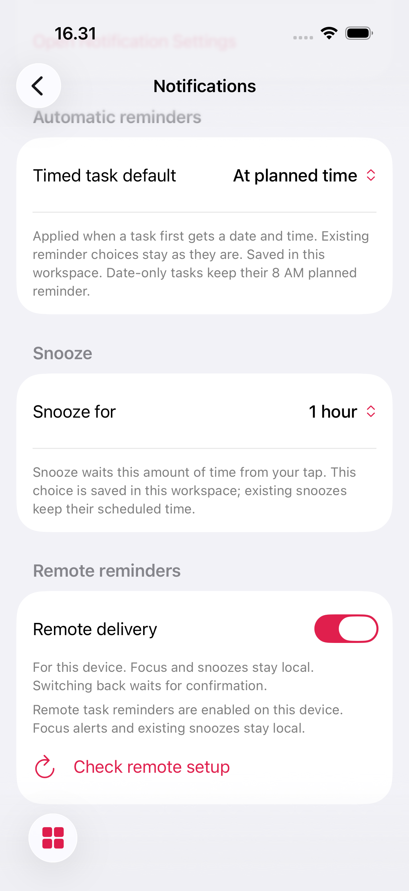
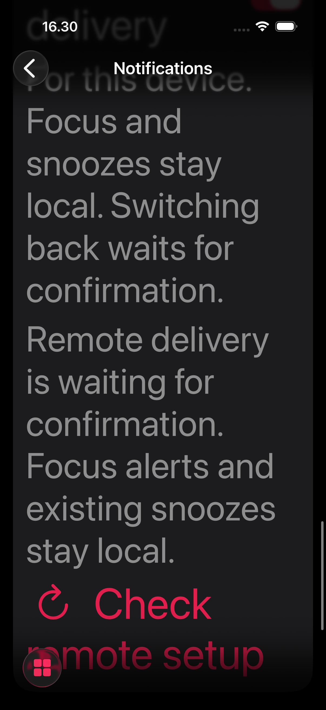
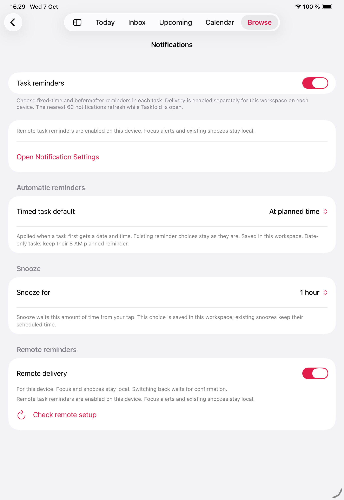
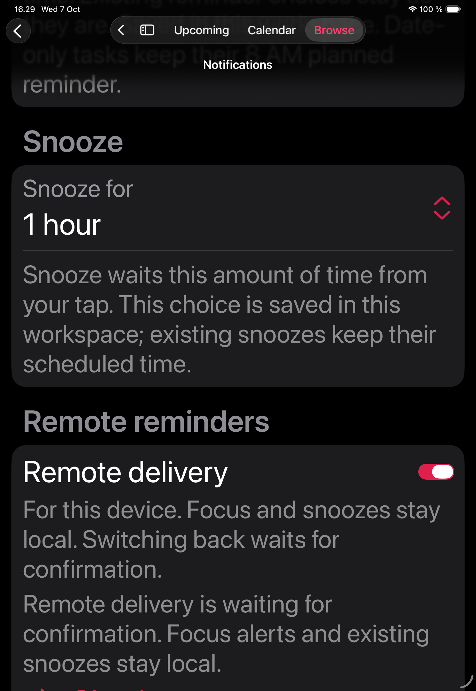

# Per-device reminder delivery authority

The iOS and Mac repositories independently implement the same version-1 handoff contract. Remote task reminders require explicit consent on each installation and server-side rollout availability. General availability remains false, there are no enrolled pilot accounts, and the native reminder cron remains inactive. This implementation does not enable production APNs delivery.

## User behavior

Notifications settings show “Remote delivery” (accessibility label: “Remote task reminders on this device”) only for an eligible rollout or an existing choice needing confirmation. Turning it on first saves durable suppression, drains original task requests through the serialized local scheduler, then sends a nonce-bound activation with the drain cutoff. The switch expresses the requested choice; status distinguishes waiting for confirmation from confirmed remote registration. Focus finish alerts and already scheduled local snoozes retain local delivery.

Turning it off waits for an exact server acknowledgement before scheduling future original task reminders locally. Offline, lost responses, expired leases, token failure and unavailable secure storage keep the handoff pending. No automatic local fallback occurs while a remote binding might remain active. Retry sends the same pending command; a newer user choice uses a higher installation revision. This avoids replaying past remote-eligible occurrences as local catch-up alerts.

A same-account restart or registration-context change retires the previous binding before enrolling the new address. Durable consent survives this retirement without exposing a transient local scheduling window. Sign-out clears the desired remote choice and persists proof-based retirement before clearing the session. A different account never inherits the old account's opt-in. Consent is device-owned and is excluded from synchronized workspaces, exports and backups.

## Secure state and failure recovery

`ReminderDeviceVault` owns the random installation ID/capability, monotonic revision, retirement intent and `mayHaveRemoteAuthority` marker. `ReminderAuthorityVault` separately owns the account, installation ID, transition nonce, phase and cutoffs. Both use AfterFirstUnlockThisDeviceOnly Keychain storage. An activation reservation saves the marker before dispatch; only an exact off/retirement receipt with valid authority metadata clears it.

Missing consent with a set marker, unreadable storage, or a missing/mismatched installation paired with a potentially active authority fails closed. The app does not create a replacement capability to claim the previous binding is retired. Recovering unavailable secure storage and retrying the original proof is required; a server device-management/reinstall recovery UI remains a separate release task. Legacy inactive installations decode without a marker. Unassociated active records are not treated as safe local delivery.

Every authority change is saved before it becomes visible to scheduling or transport. Held queue additions are serialized with the drain; held network acknowledgements are fenced by operation, account/session incarnation, revision and transition. Saving authority or installation state can fail independently without re-enabling ambiguous original delivery.

Local calendar triggers use UTC components at the first whole second on or after the event. Event metadata/signatures keep the original time. Rounding down fractional instants could deliver an alert before the handoff cutoff; rounding up avoids that overlap. Named-zone/DST scheduling remains in the canonical event resolver.

## Deployed backend contract

Apply the independently owned migrations in order:

| Version | Name | Deployed SQL MD5 |
| --- | --- | --- |
| 20261007130553 | reminder_delivery_authority | e39a31ef27d4201f3e0ac72d937c3ddb |
| 20261007131151 | private_reminder_availability | 784593714413fedd9e36a96d7562f0bf |

`taskfold_reminder_delivery_available` is an authenticated invoker wrapper over a narrowly scoped private definer. It verifies a real, matching live Auth session and returns only version, caller account and availability. Clients cannot read or update the private rollout/pilot tables. Availability ignores user-editable profile metadata.

`taskfold_activate_reminder_device` requires the existing installation proof, live owner session, eligible rollout/pilot, exact revision, transition nonce and bounded local cutoff. Inactive enrollment remains first. An identical retry preserves its lease, activation epoch and nonce. Receipt `server_time_ms` is the current observation clock, so complete receipt equality is not a retry invariant; all remaining semantic receipt fields must remain stable.

The activation epoch is strictly after the drained cutoff and retains previous permission/account/time-zone semantics. Retirement returns a server cutoff under the same device lock used by provider preparation. Unknown-device retirement remains neutral and creates no anonymous rows. Scheduled preparation requires the current activation capture, rollout eligibility, original due instant and existing task/access/session/signature/device/lease/sweep fences.

Public wrappers remain invoker functions. Necessary private definers have an empty search path and bounded execution grants. The private rollout, pilots, registry and jobs have RLS and no direct client table grants. [Supabase function security](https://supabase.com/docs/guides/database/functions) describes the underlying boundary.

## Verification scope

Each owned Core suite passes 501 tests with four existing optional live-account skips and zero failures. Coverage includes explicit consent, drain ordering, offline return to local, lost activation response/restart, cancelled drain, stale activation response, storage failure, legacy receipts, sign-out/rebind, installation mismatch, missing consent, retained snoozes/Focus, serialized queue additions and fractional-second/DST triggers.

The ten owned SQL suites cover actual anonymous/authenticated/service-role permissions, live/revoked Auth sessions, availability isolation, nonce/cutoff/replay, registration, jobs, calendar bounds/counts/cohort, durable cursor and guarded task/preference transports. They run with disposable identities inside rolled-back transactions. The cohort explicitly warms its temporary timezone catalog before asserting a fresh no-op; it still checks forced and stale refresh and the full differential/budget assertions. Both owned suites pass. Final rollback checks show no authority/cursor fixture users, no pilots and no authority-marked device rows.

Eight final iOS 26.5 Simulator flows pass: four each on iPhone 17 Pro and iPad Pro 11-inch (M5), with zero failures or skips. They cover confirmed remote/local handoff with preserved task/time, lost-response suppression and relaunch recovery, and normal-light/maximum-accessibility-dark presentation without inspection controls. Four final presentation captures were visually inspected, unmodified; functional diagnostics are labeled separately. The Core suites independently verify retained snoozes/Focus and the other failure paths.

Final native build and Simulator results, source hashes and inspected captures are recorded in the platform validation notes and `reminder-authority-evidence.json`. The DEBUG Simulator transport manufactures receipts only in the isolated ui-testing workspace and never enrolls real APNs addresses. Inspection reads actual UNUserNotificationCenter requests. These tests do not establish production provider, physical device, Mac runtime or real paired-device acceptance.

## Remaining rollout gates

Keep `TASKFOLD_APNS_DELIVERY_ENABLED=false`, the native cron inactive and the general authority rollout false. Accept final signed-token/topic/environment behavior, APNs credentials and hosted HTTP/2, physical/closed-app delivery/actions, actual paired native/offline/account/access-revocation behavior, provider ambiguity/delayed stale notifications, reinstall/device-management recovery, full-sweep production volume and an operational owner before enabling a cohort.

APNs is best effort; stable job/collapse identifiers do not prove exactly-once OS display. Alerts already accepted by the provider cannot be recalled. A revoked account's previously accepted payload privacy remains a separate acceptance gate. [Apple's remote notification guidance](https://developer.apple.com/documentation/usernotifications/setting-up-a-remote-notification-server) explains provider delivery behavior. Full P0 remains in progress.

## Final presentation captures

